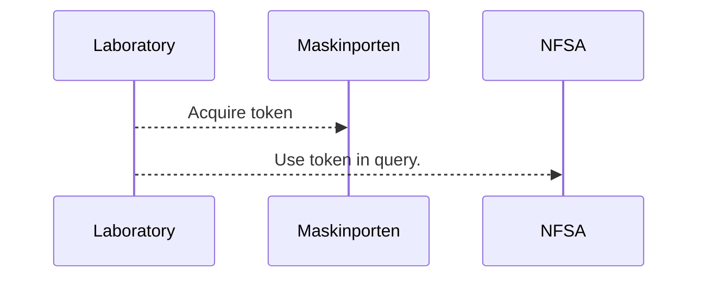
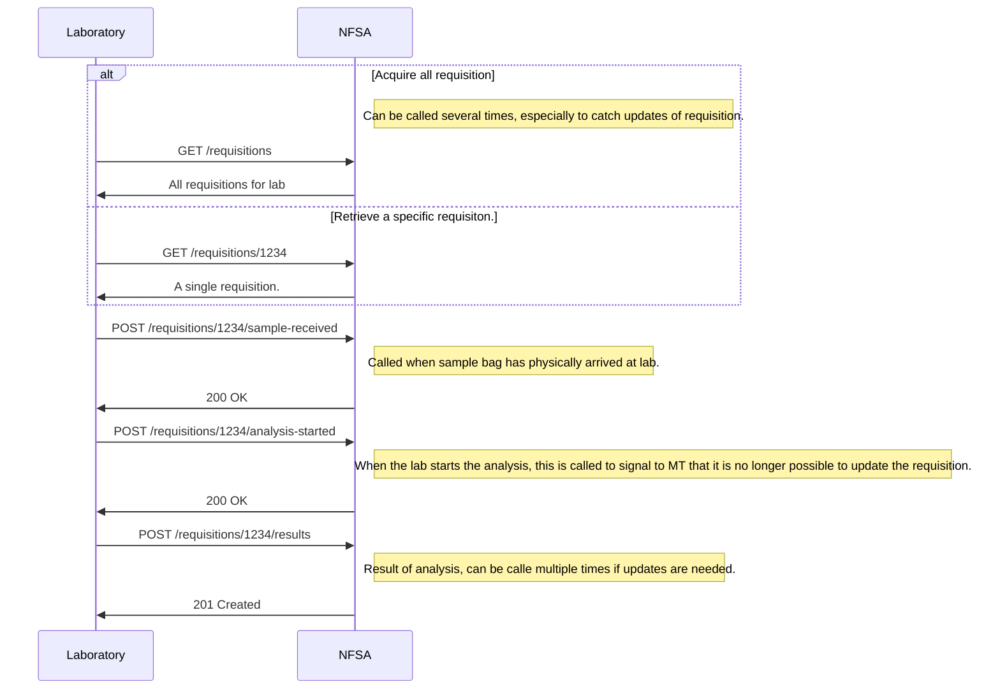
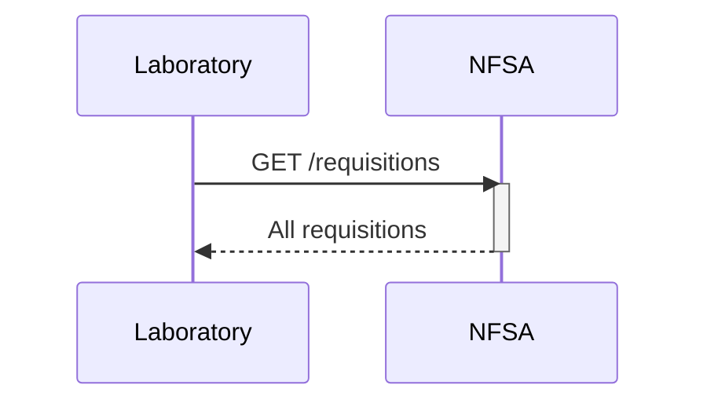

# Labintegration
For exchanging data related to integration with laboratories.
Swagger documentation can be found [here](https://sample.sample-dev.mattilsynet.io/swagger-ui/index.html?urls.primaryName=Endpoints+for+lab+integration)


## Authentication
[Maskinporten](https://docs.digdir.no/docs/Maskinporten/maskinporten_overordnet) will be used for authentication between Norwegian Food Safety Authority (NFSA) and the laboratory.
Maskinporten is a trusted third party, requires Norwegian organisation number.



## Normal operation




## Fetching requisitions for laboratory
NFSA will make all requisitions for the laboratory available at the '/requisitions' endpoint.
Retriving all requisitons can be beneficial for getting a forcast of inbound samples.



```shell
curl -X 'GET' \
  'http://sample.sample-dev.mattilsynet.io/requisitions' \
  -H 'accept: application/vnd.mattilsynet.proveta.lab+json' \
  -H 'Authorization: Bearer <TOKEN_FROM_MASKINPORTEN>'
```

