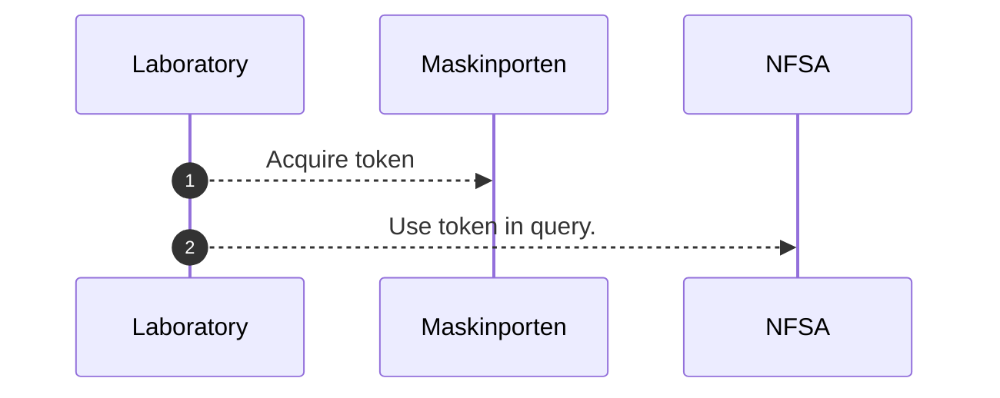
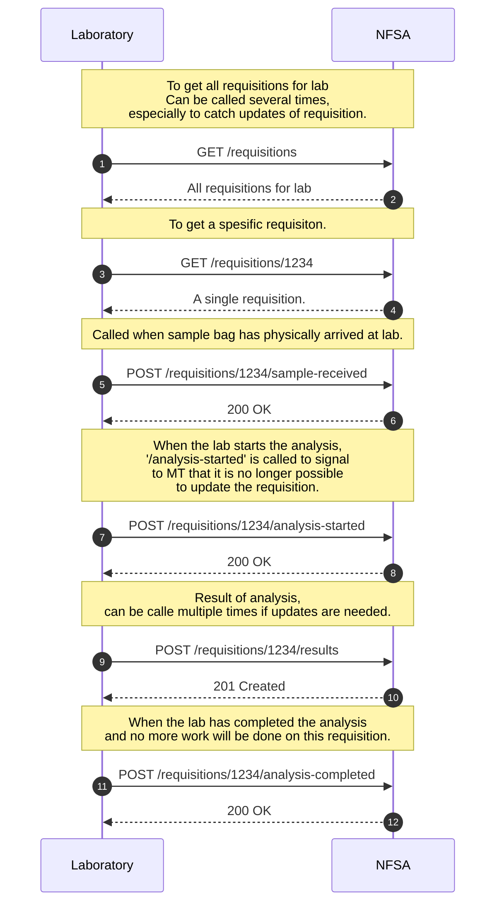

# Labintegration
For exchanging data related to integration with laboratories.
Swagger documentation can be found [here](https://sample.sample-dev.mattilsynet.io/swagger-ui/index.html?urls.primaryName=Endpoints+for+lab+integration)

## Authentication
[Maskinporten](https://docs.digdir.no/docs/Maskinporten/maskinporten_overordnet) will be used for authentication between Norwegian Food Safety Authority (NFSA) and the laboratory.
Maskinporten is a trusted third party, requires Norwegian organisation number.

## Normal operation

Mermaid config

Code below is only for configuring the mermaid diagrams above.

