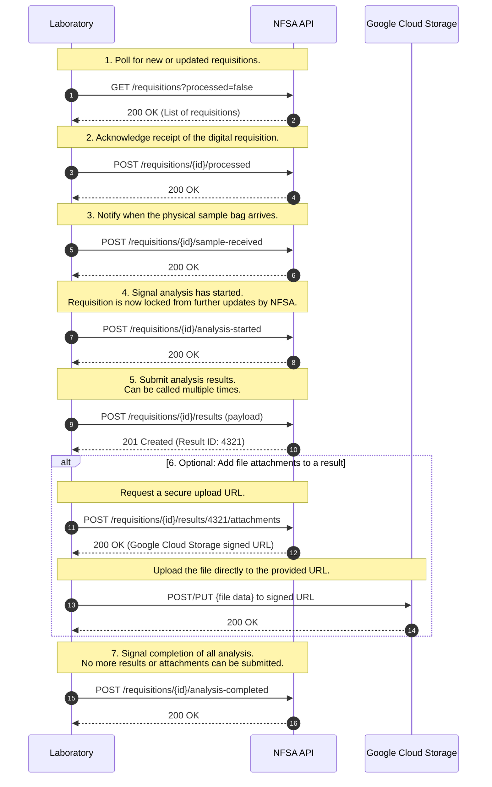
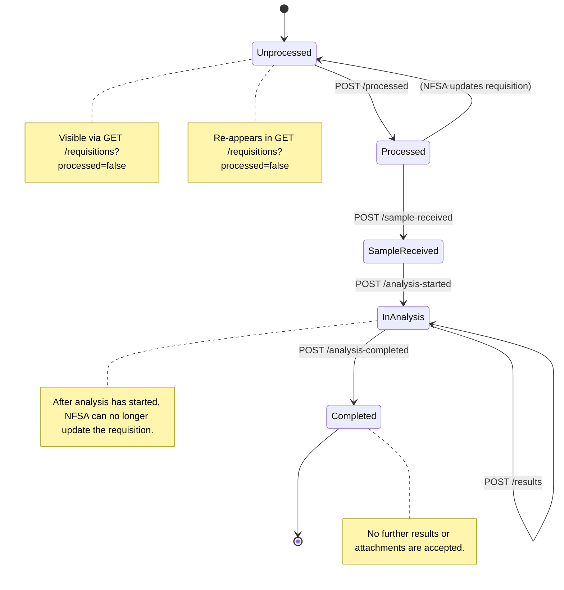

# 📘 Laboratory Integration API Guide
This document describes how laboratories can integrate with the Norwegian Food Safety Authority's (NFSA/Mattilsynet) system to handle sample requisitions and submit analysis results. It covers the necessary setup, authentication, API endpoints, and the expected operational workflow.

---
## Table of Contents
1.  [API Overview](#-api-overview)
2.  [Authentication with Maskinporten](#-authentication-with-maskinporten)
3.  [Environments & Versioning](#-environments--versioning)
4.  [Operational Workflow](#-operational-workflow)
5.  [Requisition State Model](#-requisition-state-model)
6.  [API Endpoints](#-api-endpoints)
7.  [Error Handling](#-error-handling)
8.  [Rate Limits & Polling](#-rate-limits--polling)
9.  [Code Examples](#-code-examples)

---

## 🔹 API Overview
The **Lab Integration API** allows laboratories to programmatically manage the entire lifecycle of a sample analysis. Key functionalities include:
* **Polling** for new or updated requisitions.
* **Acknowledging** receipt of digital requisitions.
* **Updating the status** of a sample as it moves through the lab (e.g., sample received, analysis started).
* **Submitting analysis results**, including optional file attachments.
* **Finalizing the process** by marking the analysis as complete.

**Swagger/OpenAPI Documentation:**
* **Development/Sandbox:** [https://sample.sample-dev.mattilsynet.io/swagger-ui/index.html](https://sample.sample-dev.mattilsynet.io/swagger-ui/index.html?urls.primaryName=Endpoints+for+lab+integration)
* **Production:** `https://sample.sample.mattilsynet.io/swagger-ui/index.html`

---

## 🔑 Authentication with Maskinporten
Authentication between the laboratory and the NFSA is handled by **Maskinporten**, which is based on the OAuth 2.0 standard.

### Setup Requirements
Before you can authenticate, you must complete a one-time setup process:
1.  **Obtain a Norwegian Business ID:** Your organization must have a Norwegian `organisasjonsnummer`. Foreign companies can obtain one by registering as a [Norwegian-registered foreign company (NUF)](https://info.altinn.no/en/start-and-run-business/planning-starting/Choosing-Legal-Structure/norwegian-branch-of-a-foreign-company-nuf/).
2.  **Create a Maskinporten Account:** Register your organization in Maskinporten.
3.  **Generate a Key Pair:** Create a public/private key pair (e.g., RSA). The public key must be associated with your account in Maskinporten.
4.  **Request API Access:** Provide your `organisasjonsnummer` to the NFSA. We will then grant your organization the necessary access rights (scopes) for our APIs.

### Acquiring an Access Token
To make API calls, you must first request an access token from Maskinporten. This is done by creating and signing a **JWT** with your private key and exchanging it for an access token.

* **Grant Type:** `urn:ietf:params:oauth:grant-type:jwt-bearer`
* **Authentication Method:** `private_key_jwt`
* **Scope:** `mattilsynet:provetaking`

For a detailed guide on creating the JWT and requesting the token, see the official documentation from Digdir: [Maskinporten API Consumer Guide](https://docs.digdir.no/docs/Maskinporten/maskinporten_guide_apikonsument) (Norwegian).

### Using the Access Token
The obtained access token must be included in the `Authorization` header of every API request as a Bearer token. The token has an expiration time defined by the `exp` claim.

**Example Header:**
`Authorization: Bearer <your_access_token>`

---

## 🌍 Environments & Versioning

### Environments
| Environment | Base URL | Authentication | Data |
| :--- | :--- | :--- | :--- |
| **Sandbox / Dev** | `https://sample.sample-dev.mattilsynet.io` | Maskinporten (Ver2) | Synthetic test data |
| **Production** | `https://sample.sample.mattilsynet.io` | Maskinporten | Real data |

### Versioning
The API uses media type versioning via the **`Accept` header**. Always specify the version you are targeting to ensure compatibility.

**Example Header:**
`Accept: application/vnd.mattilsynet.proveta.labv2+json`

---

## 🔄 Operational Workflow
The following diagram illustrates the standard sequence of operations for processing a requisition.



---

## 🚦 Requisition State Model
This diagram shows the possible states of a requisition and the API calls that trigger transitions between them.



---

## 📋 API Endpoints
| Endpoint | Method | Purpose |
| :--- | :--- | :--- |
| `/requisitions` | `GET` | Fetch a list of requisitions. Use `?processed=false` to get only new or updated ones. |
| `/requisitions/{id}` | `GET` | Fetch details for a single requisition by its ID. |
| `/requisitions/{id}/processed` | `POST` | Acknowledge that a requisition has been retrieved and stored in the lab system. |
| `/requisitions/{id}/sample-received`| `POST` | Mark that the physical sample has arrived at the laboratory. |
| `/requisitions/{id}/analysis-started`| `POST` | Signal that analysis has begun. This locks the requisition from further NFSA updates. |
| `/requisitions/{id}/results` | `POST` | Submit a batch of analysis results. Can be called multiple times. |
| `/requisitions/{id}/results/{resultId}/attachments` | `POST` | Request a secure, one-time URL to upload a file attachment for a specific result. |
| `/requisitions/{id}/analysis-completed`| `POST` | Finalize the process. No more results or attachments will be accepted. |

---

## ⚠️ Error Handling
| Status Code | Meaning | Common Cause | Recommended Action |
| :--- | :--- | :--- | :--- |
| **200 OK** | Success | Standard successful response for idempotent calls. | Continue workflow. |
| **201 Created**| Resource Created | Successful submission of new results. | Store the returned resource ID. |
| **400 Bad Request**| Invalid Payload | The request body fails schema validation. | Correct the payload and retry. |
| **401 Unauthorized**| Authentication Failed| The access token is missing, expired, or invalid. | Request a new token and retry. |
| **403 Forbidden** | Insufficient Permissions| The token is valid but lacks the required scope. | Check your Maskinporten configuration. |
| **404 Not Found** | Resource Not Found | The specified requisition ID does not exist. | Verify the ID is correct. |
| **409 Conflict** | Illegal State | The requested action is not allowed in the requisition's current state. | Check the requisition's state before retrying. |
| **5xx** | Server Error | A temporary issue occurred on the NFSA's server. | Retry with an exponential backoff strategy. |

---

## ⏱️ Rate Limits & Polling
* **Recommended Polling Frequency:** Poll `GET /requisitions?processed=false` once every **60 seconds**.
* **Minimum Interval:** Do not poll more frequently than once every **30 seconds** to avoid being rate-limited (HTTP 429).
* **Best Practice:** After fetching requisitions, **immediately** call `POST /requisitions/{id}/processed` for each one. This prevents you from receiving them again in subsequent polls unless they are updated by the NFSA.

---

## 💻 Code Examples
*Replace `$TOKEN` with your valid Maskinporten access token.*

### 1. Fetch New Requisitions
```bash
curl -X GET "https://sample.sample-dev.mattilsynet.io/requisitions?processed=false" \
 -H "Authorization: Bearer $TOKEN" \
 -H "Accept: application/vnd.mattilsynet.proveta.labv2+json"
```

### 2. Acknowledge a Requisition
```bash
curl -X POST "https://sample.sample-dev.mattilsynet.io/requisitions/123/processed" \
 -H "Authorization: Bearer $TOKEN"
```

### 3. Post Results
```bash
curl -X POST "https://sample.sample-dev.mattilsynet.io/requisitions/123/results" \
 -H "Authorization: Bearer $TOKEN" \
 -H "Content-Type: application/json" \
 -d '{
       "resultItems": [
         { "analyte": "Salmonella", "result": "Negative", "unit": "cfu/g" },
         { "analyte": "Listeria", "result": "Negative", "unit": "cfu/g" }
       ]
     }'
```

### 4. Complete Analysis
```bash
curl -X POST "https://sample.sample-dev.mattilsynet.io/requisitions/123/analysis-completed" \
 -H "Authorization: Bearer $TOKEN"
```