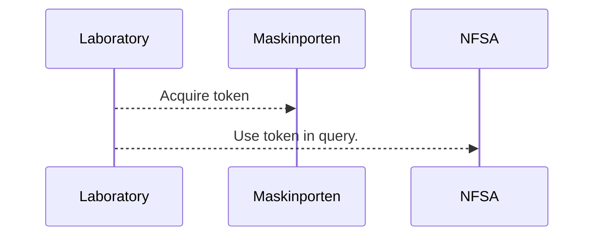
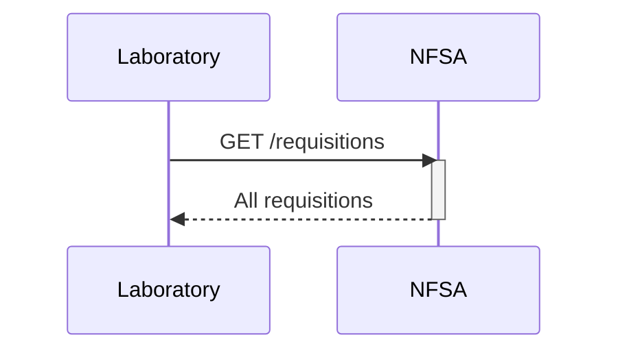

# Labintegration
For exchanging data related to integration with laboratories.
Swagger documentation can be found [here](https://sample.sample-dev.mattilsynet.io/swagger-ui/index.html?urls.primaryName=Endpoints+for+lab+integration)


## Authentication
[Maskinporten](https://docs.digdir.no/docs/Maskinporten/maskinporten_overordnet) will be used for authentication between Norwegian Food Safety Authority (NFSA) and the laboratory.
Maskinporten is a trusted third party, requires Norwegian organisation number.




## Fetching requisitions for laboratory
NFSA will make all requisitions for the laboratory available at the '/requisitions' endpoint.
Retriving all requisitons can be beneficial for getting a forcast of inbound samples.



```shell
curl -X 'GET' \
  'http://sample.sample-dev.mattilsynet.io/requisitions' \
  -H 'accept: application/vnd.mattilsynet.proveta.lab+json' \
  -H 'Authorization: Bearer <TOKEN_FROM_MASKINPORTEN>'
```

```json
[
  {
    "id": 0,
    "sampleId": "123456",
    "sampleType": {
      "id": 0,
      "matrixId": 0,
      "matrix": "Kidney",
      "matrixCode": "A01YL",
      "productId": 0,
      "product": "Veal calves",
      "productCode": "A0F1V",
      "description": "string"
    },
    "substances": [
      {
        "id": 0,
        "name": "A3F NSAIDS",
        "code": "RF-00013520-PAR"
      }
    ],
    "contractRef": "string",
    "status": "string",
    "metadata": "string",
    "createdDate": "2025-01-14T11:45:14.315Z",
    "subSamples": [
      {
        "id": 0,
        "subSampleId": 0,
        "payload": "string"
      }
    ],
    "results": {
      }
  }
]
```

<details>
<summary>Extended example of returned requisition.</summary>
```json
[
  {
    "id": 0,
    "sampleId": "123456",
    "sampleType": {
      "id": 0,
      "matrixId": 0,
      "matrix": "Kidney",
      "matrixCode": "A01YL",
      "productId": 0,
      "product": "Veal calves",
      "productCode": "A0F1V",
      "description": "string"
    },
    "substances": [
      {
        "id": 0,
        "name": "A3F NSAIDS",
        "code": "RF-00013520-PAR"
      }
    ],
    "contractRef": "string",
    "status": "string",
    "metadata": "string",
    "createdDate": "2025-01-14T11:45:14.315Z",
    "subSamples": [
      {
        "id": 0,
        "subSampleId": 0,
        "payload": "string"
      }
    ],
    "results": {
      "status": "UNDETERMINED",
      "complete": true,
      "subSamples": [
        {
          "subSampleId": 0,
          "resultSets": [
            {
              "resultId": 0,
              "resultLines": [
                {
                  "amount": 0,
                  "belowThreshold": true,
                  "detectableThreshold": 0,
                  "unitOfMeasurement": "mg/kg",
                  "method": "SOP-123",
                  "name": "string",
                  "efsaCode": "string",
                  "suggestedInterpretation": "neg"
                }
              ],
              "status": "UNDETERMINED",
              "screening": true,
              "fileName": "string",
              "fileRef": "string"
            }
          ]
        }
      ]
    }
  }
]
```
</details>
