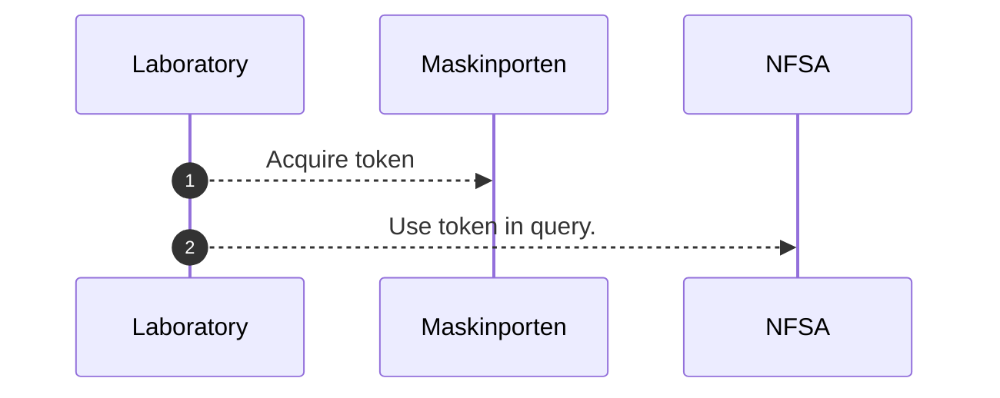
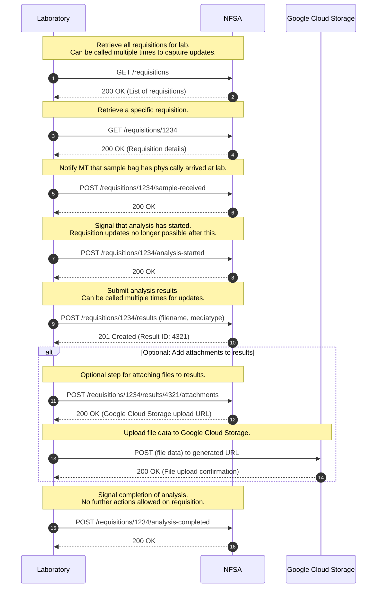

# Labintegration
For exchanging data related to integration with laboratories.
Swagger documentation can be found [here](https://sample.sample-dev.mattilsynet.io/swagger-ui/index.html?urls.primaryName=Endpoints+for+lab+integration)

## Authentication
[Maskinporten](https://docs.digdir.no/docs/Maskinporten/maskinporten_summary) will be used for authentication
between Norwegian Food Safety Authority (NFSA) and the laboratory. Maskinporten is based on the oauth2 standard.

This integration requires a norwegian registered business id (organisasjonsnummer).
For foreign companies that would require registering a new norwegian business, or registering a [Norwegian-registered foreign company (NUF)](https://info.altinn.no/en/start-and-run-business/planning-starting/Choosing-Legal-Structure/norwegian-branch-of-a-foreign-company-nuf/).

After acquiring the id, an account can be created in Maskinporten. With the account set up, a public/private-key pair must be created, and the public key associated with the account.

Mattilsynet must then be given the business id, and can then assign access to our APIs.

Then following the procedure detailed [here](https://docs.digdir.no/docs/Maskinporten/maskinporten_guide_apikonsument)
(Only in norwegian, but could be translated by Chome), the client must then build a
[JWT](https://docs.digdir.no/docs/Maskinporten/maskinporten_protocol_jwtgrant) used to request an access token, asking
for the correct scope.
The JWT is the signed with the private key from the previously created key pair, and exchanged for an access token using the
"urn:ietf:params:oauth:grant-type:jwt-bearer" grant type, and the "private_key_jwt" authentication method defined by
the oauth standard. The access token can the be used for all requests towards our REST APIs, by including it in the
"Authorization" header as a Bearer token (eg. "Authorization: Bearer <token>") as long as it is valid. The validity is
defined as an expiry date given by the "exp" property in the access token.

## Normal operation

Mermaid config

Code below is only for configuring the mermaid diagrams above.

