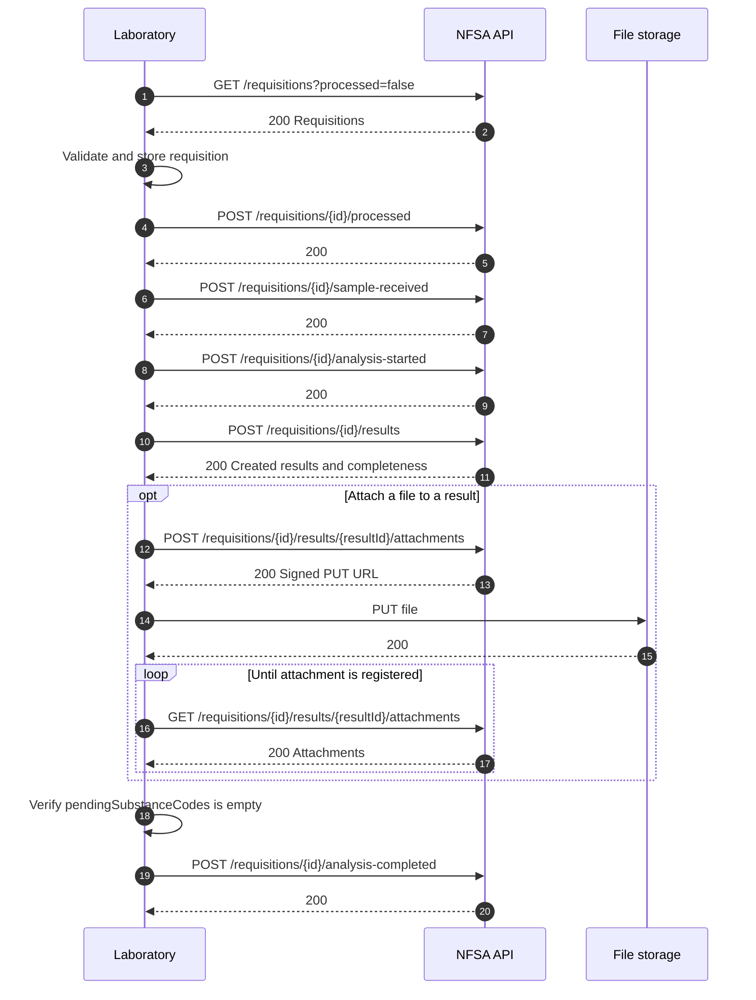

# Laboratory Integration API Guide

This guide describes how laboratories integrate with the Norwegian Food Safety Authority (NFSA/Mattilsynet) to receive sample requisitions and report analysis results.

The Swagger page contains the wire-level request and response schemas. This guide defines the required operational workflow. Use only operations tagged `LabIntegration`.

## Contents

1. [API documentation](#api-documentation)
2. [Authentication](#authentication)
3. [Environments and media types](#environments-and-media-types)
4. [Required workflow](#required-workflow)
5. [Requisitions and synchronization](#requisitions-and-synchronization)
6. [Sample and analysis status](#sample-and-analysis-status)
7. [Submitting results](#submitting-results)
8. [Attachments](#attachments)
9. [Endpoint reference](#endpoint-reference)
10. [Errors and retries](#errors-and-retries)
11. [Polling policy](#polling-policy)

## API documentation

- Development/sandbox: [Lab integration Swagger](https://sample.sample-dev.mattilsynet.io/swagger-ui/index.html?urls.primaryName=Endpoints+for+lab+integration)
- Production: [Swagger](https://sample.sample.mattilsynet.io/swagger-ui/index.html)

The lab API currently contains 13 operations. The complete list is in [Endpoint reference](#endpoint-reference).

## Authentication

The API uses Maskinporten machine-to-machine authentication based on OAuth 2.0.

### Setup

1. Obtain a Norwegian organization number (`organisasjonsnummer`). Foreign organizations may register a [Norwegian-registered foreign company (NUF)](https://info.altinn.no/en/start-and-run-business/planning-starting/Choosing-Legal-Structure/norwegian-branch-of-a-foreign-company-nuf/).
2. Register as a Maskinporten client.
3. Associate a public key with the client and keep the corresponding private key secure.
4. Provide the organization number to NFSA so that the organization can be associated with the correct laboratory.
5. Request the scope `mattilsynet:provetaking.provesvar`.

See the [Maskinporten API consumer guide](https://docs.digdir.no/docs/Maskinporten/maskinporten_guide_apikonsument) for client registration, JWT assertions, and token exchange.

### Token request

- Grant type: `urn:ietf:params:oauth:grant-type:jwt-bearer`
- Client authentication: `private_key_jwt`
- Scope: `mattilsynet:provetaking.provesvar`

Send the resulting access token with every API request:

```http
Authorization: Bearer <access-token>
```

An access token identifies an organization and its associated laboratory. A laboratory must access only requisitions and results assigned to that laboratory.

## Environments and media types

| Environment | Base URL | Data |
| --- | --- | --- |
| Development/sandbox | `https://sample.sample-dev.mattilsynet.io` | Synthetic test data |
| Production | `https://sample.sample.mattilsynet.io` | Production data |

Use HTTPS in both environments.

### Content negotiation

The requisition read API uses media-type versioning. Include this header when listing or retrieving requisitions:

```http
Accept: application/vnd.mattilsynet.proveta.labv2+json
```

Result submission accepts JSON and currently returns the V2 result representation under the following response media type:

```http
Content-Type: application/json
Accept: application/vnd.mattilsynet.proveta.v3+json
```

Attachment metadata and signed-URL operations use `application/json`. Status operations return no response body.

### Language

`GET /requisitions` and `GET /requisitions/{requisitionId}` accept `Accept-Language`:

- `no`, `nb`, and `nn` return Norwegian product and matrix descriptions.
- Other languages return English descriptions.
- Norwegian is the default when the header is omitted.

Example:

```http
Accept-Language: en
```

## Required workflow

Use this sequence for the initial processing of a requisition:


```mermaid
sequenceDiagram
    autonumber
    participant LAB as Laboratory
    participant MT as NFSA API
    participant GCS as File storage

    LAB->>MT: GET /requisitions?processed=false
    MT-->>LAB: 200 Requisitions
    LAB->>LAB: Validate and store requisition
    LAB->>MT: POST /requisitions/{id}/processed
    MT-->>LAB: 200
    LAB->>MT: POST /requisitions/{id}/sample-received
    MT-->>LAB: 200
    LAB->>MT: POST /requisitions/{id}/analysis-started
    MT-->>LAB: 200
    LAB->>MT: POST /requisitions/{id}/results
    MT-->>LAB: 200 Created results and completeness
    opt Attach a file to a result
        LAB->>MT: POST /requisitions/{id}/results/{resultId}/attachments
        MT-->>LAB: 200 Signed PUT URL
        LAB->>GCS: PUT file
        GCS-->>LAB: 200
        loop Until attachment is registered
            LAB->>MT: GET /requisitions/{id}/results/{resultId}/attachments
            MT-->>LAB: 200 Attachments
        end
    end
    LAB->>LAB: Verify pendingSubstanceCodes is empty
    LAB->>MT: POST /requisitions/{id}/analysis-completed
    MT-->>LAB: 200
```

The initial workflow requirements are:

1. Store and validate a requisition before acknowledging it.
2. Report physical receipt before starting analysis.
3. Report analysis start before submitting results. Analysis start prevents NFSA from changing the requisition.
4. Use only substance codes and subsample IDs supplied in the requisition.
5. Submit as many result batches as necessary.
6. Confirm that every initial attachment appears in the attachment list before completing the analysis.
7. Call `analysis-completed` only when `pendingSubstanceCodes` is empty.

Do not rely on server-side validation as a substitute for enforcing this sequence in the laboratory system.

### Corrections after completion

`analysis-completed` marks the initial analysis ready for NFSA processing. If a correction is subsequently required:

- Append a new result batch. Existing result batches are not overwritten.
- Do not call `analysis-completed` again after appending a corrective batch.
- New attachments may be uploaded and must be confirmed through the attachment list.
- Do not delete attachments after completion.

## Requisitions and synchronization

### List requisitions

```http
GET /requisitions
```

Supported filters:

| Parameter | Requisitions returned |
| --- | --- |
| `processed=false` | Requisitions whose latest version has not yet been acknowledged by the laboratory using `POST /requisitions/{requisitionId}/processed`. This includes new requisitions and requisitions changed by NFSA after an earlier acknowledgement. |
| `processed=true` | Requisitions whose latest version has already been acknowledged by the laboratory using `POST /requisitions/{requisitionId}/processed`. |
| `sampleId` | Exact sample/bag identifier |
| `updatedAfter` | Requisitions updated at or after an ISO 8601 timestamp |

Omit `processed` to return both processed and unprocessed requisitions. `updatedAfter` is inclusive; clients should therefore de-duplicate requisitions by ID and update data already stored locally.

Example:

```bash
curl --request GET \
  "https://sample.sample-dev.mattilsynet.io/requisitions?processed=false" \
  --header "Authorization: Bearer $TOKEN" \
  --header "Accept: application/vnd.mattilsynet.proveta.labv2+json" \
  --header "Accept-Language: en"
```

The endpoint returns `200 OK` and an array. An empty array is a normal response.

### Retrieve one requisition

```http
GET /requisitions/{requisitionId}
```

Important response fields include:

| Field | Use |
| --- | --- |
| `id` | Value used as `{requisitionId}` in subsequent calls |
| `sampleId` | Sample/bag identifier; also required in result submission |
| `sampleType` | Product and matrix details |
| `substances` | Expected substances and the codes used in result submission |
| `subSamples` | Subsample IDs used in results and compromise reports |
| `contractRef` | Plan or programme reference |
| `metadata` | Optional JSON serialized as a string |
| `status` | Current sample workflow status |
| `processed` | Whether the latest requisition version has been acknowledged |
| `latestProcessingError` | Latest unresolved error reported by the laboratory |
| `reportedSubstanceCount` | Number of expected substances with at least one result |
| `totalSubstanceCount` | Number of expected substances |
| `pendingSubstanceCodes` | Expected substance codes for which no result has been submitted |

The response includes an `ETag` header. Cache it and send the exact value in `If-None-Match` on the next request:

```bash
curl --request GET \
  "https://sample.sample-dev.mattilsynet.io/requisitions/123" \
  --header "Authorization: Bearer $TOKEN" \
  --header "Accept: application/vnd.mattilsynet.proveta.labv2+json" \
  --header 'If-None-Match: "previous-etag"'
```

The API returns `304 Not Modified` without a body when the ETag matches.

### Acknowledge processing

```http
POST /requisitions/{requisitionId}/processed
Content-Type: application/json
```

Always send a request body. A successful import uses:

```json
{
  "success": true
}
```

If the laboratory cannot import or validate the requisition, acknowledge the failed attempt and include a useful reason:

```json
{
  "success": false,
  "reason": "Unsupported substance code RF-00013520-PAR"
}
```

Both forms acknowledge the current requisition version. A failed acknowledgement therefore also removes the requisition from `processed=false` results until NFSA changes it. Store the failure locally and use the agreed support process to resolve it. The failure is exposed as `latestProcessingError` on the requisition.

Example:

```bash
curl --request POST \
  "https://sample.sample-dev.mattilsynet.io/requisitions/123/processed" \
  --header "Authorization: Bearer $TOKEN" \
  --header "Content-Type: application/json" \
  --data '{"success":true}'
```

Processing acknowledgement is separate from sample status. It does not mean that the physical sample has arrived or that analysis has started.

## Sample and analysis status

The `status` returned on a requisition is the sample workflow status. Common lab-relevant values are:

| Status | Meaning |
| --- | --- |
| `SampleSent` | The sample has been sent to the laboratory |
| `SampleReceived` | The laboratory has reported physical receipt |
| `AnalysisStarted` | Analysis has started and NFSA changes are locked |
| `Compromised` | All subsamples are marked unfit for analysis |
| `Closed` | Processing and archival handling are closed |

Other event values may be present. Do not infer processing acknowledgement from `status`; use the `processed` field.

### Report physical receipt

```http
POST /requisitions/{requisitionId}/sample-received
```

This operation has no request or response body and returns `200 OK`.

```bash
curl --request POST \
  "https://sample.sample-dev.mattilsynet.io/requisitions/123/sample-received" \
  --header "Authorization: Bearer $TOKEN"
```

### Report compromised subsamples

```http
POST /requisitions/{requisitionId}/sample-compromised
Content-Type: application/json
```

Every sample has at least one entry in `subSamples`. Use its `subSampleId`, not its internal `id`:

```json
{
  "subSamples": [
    {
      "subsampleid": 1,
      "state": true,
      "reason": "Seal broken during transit"
    }
  ]
}
```

Set `state` to `false` to reverse an erroneous compromise report and provide a reason describing the correction. The overall status becomes `Compromised` when all subsamples are compromised. If a compromise is reversed, the sample returns to its previous business status.

### Report analysis start

```http
POST /requisitions/{requisitionId}/analysis-started
```

This operation has no request or response body and returns `200 OK`. After this call, NFSA can no longer change the requisition.

```bash
curl --request POST \
  "https://sample.sample-dev.mattilsynet.io/requisitions/123/analysis-started" \
  --header "Authorization: Bearer $TOKEN"
```

### Complete initial analysis

```http
POST /requisitions/{requisitionId}/analysis-completed
```

Before calling this endpoint:

1. Check the latest result response or requisition representation.
2. Verify that `pendingSubstanceCodes` is empty.
3. Verify that all initial file uploads appear in their attachment lists.

The operation has no request or response body and returns `200 OK`. The requisition status becomes `ReadyToProcess`; `Completed` is a later NFSA status.

```bash
curl --request POST \
  "https://sample.sample-dev.mattilsynet.io/requisitions/123/analysis-completed" \
  --header "Authorization: Bearer $TOKEN"
```

## Submitting results

```http
POST /requisitions/{requisitionId}/results
Content-Type: application/json
Accept: application/vnd.mattilsynet.proveta.v3+json
```

The request contains a batch of results. The top-level `id` must exactly match the requisition's `sampleId`.

For each result:

- `subSampleId` must be a `subSampleId` returned in the requisition. Always send it, including when the sample has only one subsample.
- `substance`, when supplied, must be a substance `code` returned in the requisition.
- `resultLines` contains one or more observations.
- `suggestedInterpretation` may be `pos`, `neg`, `inc`, or omitted.

Each result line requires `name`, `method`, and `unitOfMeasurement`. `amount` may be omitted for a non-numeric observation. Optional `remarks` are limited to 256 characters.

Example request:

```json
{
  "id": "A13234",
  "results": [
    {
      "subSampleId": 1,
      "substance": "RF-00013520-PAR",
      "suggestedInterpretation": "neg",
      "resultLines": [
        {
          "name": "Primary analysis",
          "efsaCode": "RF-00013520-PAR",
          "amount": 0.1,
          "belowThreshold": true,
          "detectableThreshold": 0.5,
          "unitOfMeasurement": "mg/kg",
          "method": "SOP-123",
          "suggestedInterpretation": "neg",
          "remarks": "No matrix interference observed",
          "measurementUncertainty": {
            "value": 0.02,
            "coverageFactor": 2
          }
        }
      ]
    }
  ]
}
```

```bash
curl --request POST \
  "https://sample.sample-dev.mattilsynet.io/requisitions/123/results" \
  --header "Authorization: Bearer $TOKEN" \
  --header "Content-Type: application/json" \
  --header "Accept: application/vnd.mattilsynet.proveta.v3+json" \
  --data @result.json
```

A successful request returns `200 OK`, not `201 Created`:

```json
{
  "id": "A13234",
  "results": [
    {
      "id": 4321,
      "subSampleId": 1,
      "substance": "RF-00013520-PAR",
      "resultLines": [
        {
          "name": "Primary analysis",
          "amount": 0.1,
          "unitOfMeasurement": "mg/kg",
          "method": "SOP-123"
        }
      ]
    }
  ],
  "reportedSubstanceCount": 1,
  "totalSubstanceCount": 3,
  "pendingSubstanceCodes": [
    "RF-00013506-PAR",
    "RF-00000309-VET"
  ]
}
```

Store every returned result `id`; attachment operations require it. Result submissions append records and are not idempotent. If a request times out after transmission, retrieve the requisition and inspect its results before retrying to avoid duplicate records.

### Measurement uncertainty

`measurementUncertainty.value` is an absolute uncertainty in the result line's `unitOfMeasurement`. It must be zero or greater. `coverageFactor` must be at least 1; for example, `2` commonly represents expanded uncertainty at approximately 95 percent coverage under normal-distribution assumptions.

## Attachments

Attachments use a three-step asynchronous process:

1. Request a signed upload URL from the API.
2. Upload the file directly with HTTP `PUT`.
3. Poll the attachment list until the uploaded file appears.

Receiving `200 OK` from file storage confirms only that the bytes were uploaded. It does not confirm that attachment metadata has been registered by the API.

### Request an upload URL

```http
POST /requisitions/{requisitionId}/results/{resultId}/attachments
Content-Type: application/json
```

```json
{
  "fileName": "analysis-report.pdf",
  "mediaType": "application/pdf",
  "fileSize": 245760
}
```

`fileSize` is optional metadata. Use a plain file name without directory components, and use a unique name when uploading a replacement file to the same result.

```bash
curl --request POST \
  "https://sample.sample-dev.mattilsynet.io/requisitions/123/results/4321/attachments" \
  --header "Authorization: Bearer $TOKEN" \
  --header "Content-Type: application/json" \
  --data '{
    "fileName": "analysis-report.pdf",
    "mediaType": "application/pdf",
    "fileSize": 245760
  }'
```

The API returns `200 OK` with a signed URL valid until `expiration`:

```json
{
  "signedUrl": "https://storage.googleapis.com/...",
  "expiration": "2026-08-24T12:15:00Z"
}
```

Upload with `PUT` and the same media type used in the URL request:

```bash
curl --request PUT \
  "$SIGNED_URL" \
  --header "Content-Type: application/pdf" \
  --upload-file "analysis-report.pdf"
```

Do not send the Maskinporten token to the signed storage URL.

### List attachments

```http
GET /requisitions/{requisitionId}/results/{resultId}/attachments
```

The endpoint returns `200 OK` and an array. Poll until the expected `filename` appears before completing the initial analysis or treating a corrective upload as finished.

```json
[
  {
    "id": 81,
    "filename": "analysis-report.pdf",
    "storageLink": "https://storage.googleapis.com/...",
    "downloadLink": "/requisitions/123/results/4321/attachments/81/download",
    "mediaType": "application/pdf"
  }
]
```

### Retrieve attachment metadata

```http
GET /requisitions/{requisitionId}/results/{resultId}/attachments/{attachmentId}
```

This returns `200 OK` with one attachment object.

### Download an attachment

```http
GET /requisitions/{requisitionId}/results/{resultId}/attachments/{attachmentId}/download
```

The endpoint returns a temporary signed download URL:

```json
{
  "url": "https://storage.googleapis.com/..."
}
```

Use a normal unauthenticated `GET` against the signed URL. Do not send the Maskinporten token to file storage.


## Endpoint reference

All paths are relative to the environment base URL.

| Method | Path | Success | Purpose |
| --- | --- | --- | --- |
| `GET` | `/requisitions` | `200` | List assigned requisitions |
| `GET` | `/requisitions/{requisitionId}` | `200`, `304` | Retrieve one requisition, optionally using an ETag |
| `POST` | `/requisitions/{requisitionId}/processed` | `200` | Acknowledge successful or failed local processing |
| `POST` | `/requisitions/{requisitionId}/sample-received` | `200` | Report physical sample receipt |
| `POST` | `/requisitions/{requisitionId}/sample-compromised` | `200` | Mark or unmark subsamples as compromised |
| `POST` | `/requisitions/{requisitionId}/analysis-started` | `200` | Report that analysis has started |
| `POST` | `/requisitions/{requisitionId}/results` | `200` | Append a result batch |
| `POST` | `/requisitions/{requisitionId}/results/{resultId}/attachments` | `200` | Create a signed upload URL |
| `GET` | `/requisitions/{requisitionId}/results/{resultId}/attachments` | `200` | List registered attachments |
| `GET` | `/requisitions/{requisitionId}/results/{resultId}/attachments/{attachmentId}` | `200` | Retrieve attachment metadata |
| `GET` | `/requisitions/{requisitionId}/results/{resultId}/attachments/{attachmentId}/download` | `200` | Create a signed download URL |
| `POST` | `/requisitions/{requisitionId}/analysis-completed` | `200` | Mark the initial analysis ready for NFSA processing |

## Errors and retries

Errors use `application/problem+json`. A response can include:

```json
{
  "type": "/invalid-input",
  "title": "Bad Request",
  "status": 400,
  "detail": "Result substance RF-00000000 not valid for requisition",
  "instance": "/requisitions/123/results",
  "traceId": "0123456789abcdef"
}
```

Include `traceId` and `requisitionId` when contacting NFSA support.

| Status | Meaning | Action |
| --- | --- | --- |
| `400 Bad Request` | Invalid JSON, schema, sample ID, substance, subsample, or measurement uncertainty | Correct the request; do not retry unchanged |
| `401 Unauthorized` | Missing, expired, or invalid token | Acquire a valid token and retry |
| `403 Forbidden` | Missing scope, missing lab association, or resource assigned to another lab | Correct onboarding or authorization; do not retry unchanged |
| `404 Not Found` | Requisition, result, or attachment does not exist or is not visible to this lab | Verify all nested IDs; do not retry unchanged |
| `409 Conflict` | Resource is in an incompatible state or cannot be modified | Retrieve current state and resolve the conflict |
| `429 Too Many Requests` | Polling or request rate is too high | Honor `Retry-After` when present and back off |
| `5xx` | Temporary NFSA or upstream failure | Retry with exponential backoff and jitter |

Do not automatically retry `POST` requests unless it is known that the server did not process the request. The API does not currently accept an idempotency key. After an ambiguous result or upload request, inspect the corresponding resource before retrying.

Suggested retry delays for temporary errors are 1, 2, 4, 8, and 16 seconds, with random jitter and a maximum retry count appropriate to the laboratory's operational requirements.

## Polling policy

- Poll `GET /requisitions?processed=false` once every 60 seconds.
- Do not poll more frequently than once every 30 seconds.
- HTTP `429 Too Many Requests` may be returned when the platform limit is exceeded.
- Process each returned requisition independently so that one invalid requisition does not block the others.
- Call `/processed` only after the current requisition representation has been stored and validated.
- Persist the latest seen requisition ID, update data, and processing outcome so polling can safely resume after a restart.
